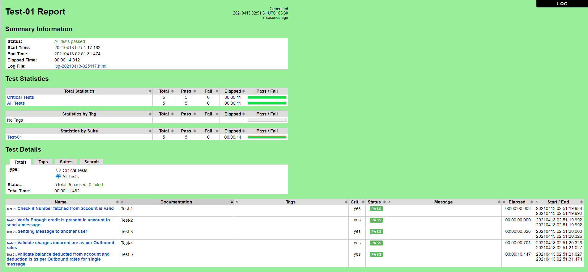
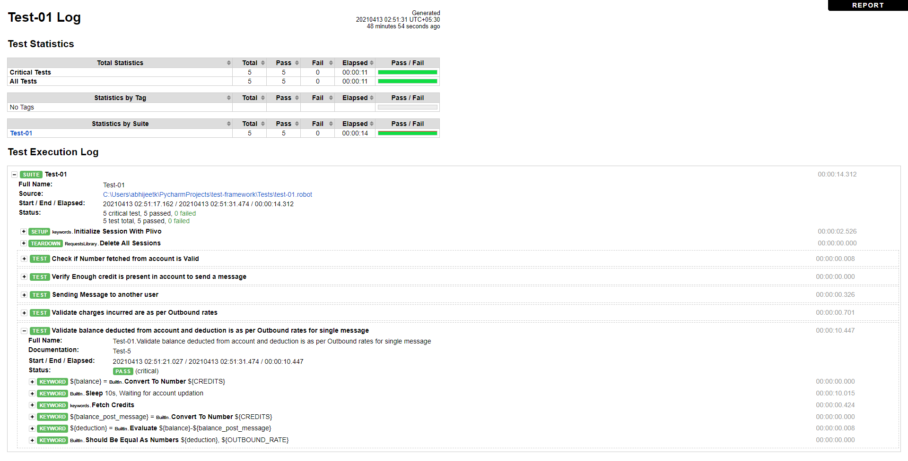

# test-framework 

<h3>This test framework is written in RobotFramework which is a keyword driven framework</h3> 
For reference please visit https://robotframework.org/#libraries 

<h3>Usage Details</h3> 
Execute the test cases with below commands 
robot --timestampoutputs -d Reports Tests/test-01.robot 

You can also add multiple files like test-02, test-03 and so on under Tests path and execute all test cases in all files by specifying the directory instead 
robot --timestampoutputs -d Reports Tests 

Reports are generated in the Reports directory, please check reports uploaded from last execution 

You can add any python code as a function in CustomLibrary path, add it to Resources/common.robot and use the same function as a Keyword in your robot suites 

New keywords can be defined in Resources/keyword.robot file, and used as a Keyword in the robot test suites 

New Variables can be added to Variable/variables.robot and used in keyword.robot or directly in the test suites 

Sample report looks like below 

Sample Log looks like below 

